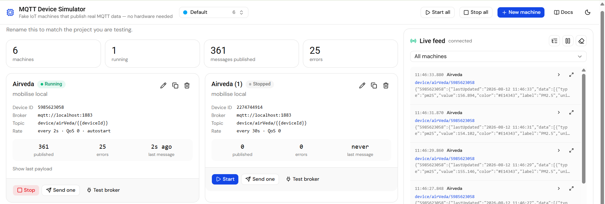
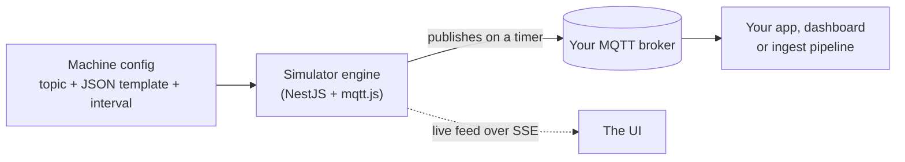
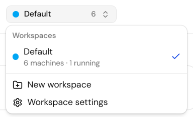
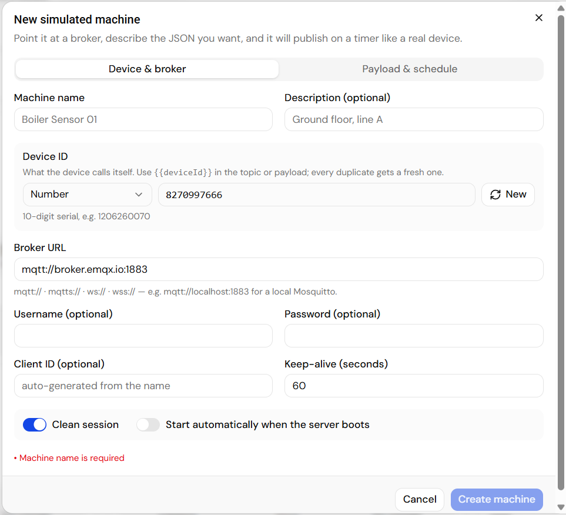
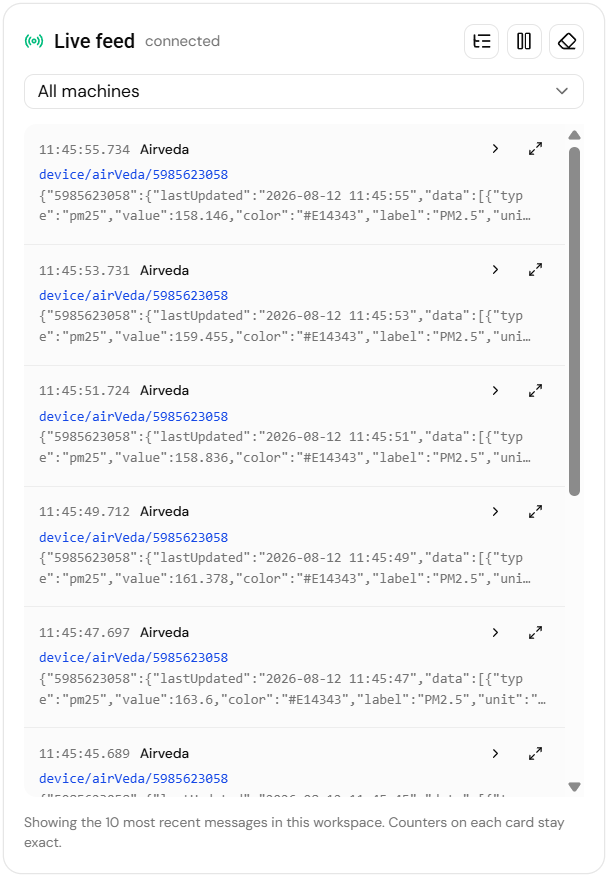

# MQTT Device Simulator — fake IoT devices that publish real MQTT

Open-source MQTT device simulator and test data generator. Spin up virtual IoT machines
that connect to **any** MQTT broker — Mosquitto, EMQX, HiveMQ, AWS IoT, your own — and
publish realistic JSON telemetry on a timer, so you can build and test the software
without owning a single device.



## What it is

A web app with two parts: a **NestJS** backend that holds the MQTT clients and does the
publishing, and a **React** UI to configure it. You describe a device — broker URL,
topic, the JSON shape you want, how often — and it behaves like the real thing: smooth
sensor drift, incrementing counters, rotating status values, GPS that actually moves.

Nothing is mocked at the protocol level. It is a real MQTT client on a real connection,
so whatever subscribes to your broker cannot tell the difference.

## Why you'd want one

- **The hardware isn't ready.** Build the dashboard, the ingest pipeline and the alerting
  before a single sensor ships.
- **You need data that looks real.** Random numbers make charts look wrong. `{{walk}}`
  drifts like a temperature probe; `{{sin}}` cycles like a daily load curve.
- **You need a *fleet*, not one device.** Duplicate a machine 50 times in one click —
  each copy gets its own device ID and MQTT client ID — and watch your consumer cope.
- **You need to reproduce a bug.** Save the exact payload shape and rate that broke
  things, and replay it whenever you want.
- **You need to demo without a lab.** A laptop and a broker is the whole setup.

## Who it's for

Backend and IoT developers writing MQTT consumers · dashboard and frontend teams who need
a live data source · QA testing throughput, QoS and reconnect behaviour · anyone giving an
IoT demo without hauling hardware · students learning MQTT.

## Quickstart

Two terminals, no config:

```bash
git clone https://github.com/rishabhraj291196/mqtt-data-explorer.git
cd mqtt-data-explorer

# 1. API + MQTT engine  → http://localhost:3006/api
cd backend && npm install && npm run start:dev

# 2. UI                 → http://localhost:5173
cd frontend && npm install && npm run dev
```

Open <http://localhost:5173>. No broker handy? One line:

```bash
docker run -d --name emqx -p 1883:1883 -p 8083:8083 -p 18083:18083 emqx/emqx:latest
```

## How it works



Each machine is one real MQTT client. The engine renders your template — replacing
`{{token}}` placeholders with fresh values every tick — and publishes it at the interval
you set. Configs live in a JSON file on disk, so they survive restarts.

## Features at a glance

| | |
| --- | --- |
| **Any broker** | `mqtt://` · `mqtts://` · `ws://` · `wss://`, with username/password, client ID, keep-alive and clean-session control |
| **Realistic data** | 25+ tokens: smooth drift, sine waves, counters, sequences, weighted booleans, UUIDs, timestamps, GPS, MAC/IP |
| **Linked values** | `{{var}}` generates once and reuses everywhere; `{{range}}` derives a colour or label from that same number |
| **Fleets** | Duplicate a machine up to 50× — each copy gets its own device ID and client ID |
| **Workspaces** | Separate projects that cannot see each other's machines |
| **Live feed** | Every publish streamed to the browser over SSE, pretty-printed and filterable |
| **Preview before saving** | Render three sample messages without publishing anything |
| **Full REST API** | Everything the UI does is scriptable |

**Workspaces** keep unrelated projects apart. Each one has its own machines, its own live
feed and its own *Start all* — nothing in one project can see or touch another's:



Describe a device once — broker, identity, topic, JSON, rate — and **Preview** the exact
messages before you save:



Watch every message land in real time, expand any row into colour-coded JSON, or pin the
feed to a single machine:



---

## Project layout

- **backend/** — NestJS API + the MQTT publishing engine
- **frontend/** — React (Vite + Tailwind + shadcn) configuration UI

---

## Setup in detail

**Requirements:** Node 20+ and any reachable MQTT broker.

The UI proxies `/api` to `http://localhost:3006`, so nothing else needs configuring.
Change the port in `backend/.env` (`PORT`) and in `frontend/vite.config.ts`
(`API_TARGET`) if 3006 is taken. Copy `backend/.env.example` to `backend/.env` to start
from the documented defaults.

### Which broker?

Anything reachable works — set it per machine in the UI:

| Broker | URL |
| --- | --- |
| Local Mosquitto / EMQX | `mqtt://localhost:1883` |
| Public test broker | `mqtt://broker.emqx.io:1883` |
| WebSocket listener | `ws://localhost:8083/mqtt` |
| TLS | `mqtts://your-broker:8883` |

`MQTT_DEFAULT_URL` in `backend/.env` pre-fills the "new machine" form.

---

## Using it

1. **New machine** → give it a name, a **Device ID** and a broker URL.
2. **Payload & schedule** tab → pick a preset (temperature sensor, energy meter, GPS
   tracker, …) or write your own JSON, set the topic and the interval.
3. **Preview** → see the exact messages it will publish before saving.
4. **Create machine** → then **Start**.

Messages appear in the **Live feed** on the right, and your own software can subscribe
to the topic as if a real device were sending them. By default it shows every machine —
**click a machine card** to pin the feed to that one machine, and click it again (or the
× beside the dropdown) to go back to all.

In the feed, a row expands into pretty-printed, colour-coded JSON (▸ per row, or the
tree icon to expand every row), and the ⤢ icon opens the message full width with its
topic, QoS, size and a **Copy JSON** button. Only the 10 newest messages are kept —
the per-machine counters stay exact regardless.

Other things the UI can do:

- **Send one** — publish a single message without starting the timer.
- **Test broker** — connect/disconnect to verify credentials.
- **Duplicate** — copy an existing machine up to 50 times in one go; each copy keeps
  the broker, topic and template but gets its own name, machine ID and client ID.
- **Start all / Stop all** — run every machine in the current workspace at once.
- **Move** — hand a machine to another workspace without rebuilding it.
- **Autostart** — bring a machine up automatically whenever the backend boots.

Machines are saved to `backend/data/machines.json` and workspaces to
`backend/data/workspaces.json`, so both survive restarts.

---

## Workspaces

One simulator, several projects. A **workspace** is a project boundary: every machine
belongs to exactly one, and nothing about it is reachable from any other — not the list,
not start/stop, not the live feed. Switch projects instead of deleting and re-creating
the same fleet.

Use the switcher in the header to change project, create a new one, or open
**Workspace settings** to rename it, recolour it or delete it. The switcher shows each
project's machine count and how many are running right now.

- **Machines never cross over.** A machine id from another workspace reads as *not
  found* on every verb — read, edit, delete, start, stop, clone, publish.
- **The live feed is per project.** So is *Start all*, *Stop all* and *Clear feed*.
- **Moving beats re-creating.** The move button on a card hands the machine over
  keeping its id, device id and counters; a running machine does not even reconnect.
- **Deleting a project deletes its machines**, after stopping them. The last remaining
  workspace cannot be deleted — rename it instead.
- **Autostart ignores workspaces.** Every project's autostart machines come up when the
  backend boots, not just whichever one you happen to open.

Existing installs need no migration: machines saved before workspaces existed are
adopted into a **Default** workspace the first time the backend starts.

---

## Payload templates

A template is ordinary JSON with `{{token}}` placeholders. Keep tokens **inside quotes**
so the template stays valid JSON — a value that is exactly one token is replaced with
its real type:

```json
{
  "deviceId": "{{deviceId}}",
  "temperature": "{{walk:18:42:0.4}}",
  "state": "{{oneOf:RUNNING|IDLE|FAULT}}",
  "cycle": "{{counter}}",
  "timestamp": "{{iso}}"
}
```

publishes

```json
{
  "deviceId": "8f3c…",
  "temperature": 24.3,
  "state": "RUNNING",
  "cycle": 42,
  "timestamp": "2026-08-03T10:15:30.123Z"
}
```

Nested objects and arrays work too. Tokens mixed with text interpolate as strings
(`"fw": "2.4.{{int:0:9}}"` → `"2.4.7"`). Topics accept tokens as well, e.g.
`factory/{{deviceId}}/telemetry`.

### Device IDs

Every machine carries a **Device ID** — the identity it reports as `{{deviceId}}`.
Pick the shape in the machine form:

| Format | Looks like |
| --- | --- |
| Number | `1206260070` — 10-digit serial |
| Alphanumeric | `a3f9c2d1b7e4` — 12 letters and digits |
| Custom | whatever you type |

Hit **New** to mint another one, and every duplicate gets its own — so cloning a
machine 20 times gives you 20 distinct devices without renaming anything.

### Tokens

| Token | Gives you |
| --- | --- |
| `{{int:min:max}}` | Random whole number |
| `{{float:min:max:decimals}}` | Random decimal |
| `{{walk:min:max:maxStep}}` | Smooth drift — remembers the previous value (best for sensors) |
| `{{sin:min:max:periodSeconds}}` | Sine wave |
| `{{counter}}` / `{{counter:start:step}}` | Incrementing number |
| `{{bool}}` / `{{bool:probability}}` | `true` / `false` |
| `{{oneOf:A\|B\|C}}` | Random pick |
| `{{seq:A\|B\|C}}` | Cycles in order |
| `{{uuid}}` | UUID v4 |
| `{{iso}}` · `{{epoch}}` · `{{unix}}` · `{{date}}` · `{{time}}` | Timestamps |
| `{{deviceId}}` | The device id configured on the machine — see below |
| `{{machineId}}` · `{{machineName}}` · `{{tick}}` | Internal UUID / display name / message number |
| `{{str:len}}` · `{{hex:len}}` · `{{ip}}` · `{{mac}}` · `{{lat}}` · `{{lng}}` | Misc |
| `{{var:name:token}}` / `{{var:name}}` | Generate once, reuse the same value elsewhere in the message |
| `{{range:name:limit=out\|…\|*=out}}` | Derive an output (colour, label, …) from a `{{var}}` value |

The **Tokens** button in the UI shows the same list with examples. For the full reference —
every argument, its default, the type each token publishes, worked examples and the
`machines.json` field table — open **Docs** in the header (`/docs.html`, served from
`frontend/public/docs.html`).

### Shapes that need more than one field

Object **keys** accept tokens as well, so a payload can be keyed by device ID. And
`{{var}}` + `{{range}}` let one generated number drive several fields — the same
battery reading in two places, a colour that actually matches its value:

```json
{
  "{{deviceId}}": {
    "lastUpdated": "{{date}} {{time}}",
    "data": [
      {
        "type": "aqi",
        "value": "{{var:aqi:walk:20:220:4}}",
        "color": "{{range:aqi:50=#17AF35|100=#74CB40|150=#E1CB43|*=#E14343}}",
        "label": "AQI"
      },
      { "type": "battery", "value": "{{var:batt:walk:5:100:0.4}}", "label": "Battery" }
    ],
    "battery": "{{var:batt}}"
  }
}
```

→ with the machine's Device ID set to `1206260070` it publishes

```json
{
  "1206260070": {
    "lastUpdated": "2026-08-03 12:43:53",
    "data": [
      { "type": "aqi", "value": 36.125, "color": "#17AF35", "label": "AQI" },
      { "type": "battery", "value": 50.776, "label": "Battery" }
    ],
    "battery": 50.776
  }
}
```

`{{var:name:…}}` is evaluated before anything else, so `{{var:name}}` and
`{{range:name:…}}` may appear anywhere — even above the field that defines the value.
`{{range}}` picks the first bucket whose limit the number is `<=`; `*` is the fallback.
The **Air quality monitor** preset in the UI is exactly this pattern, filled in.

If the template is not valid JSON it is published as raw text instead, so CSV or plain
values also work.

---

## API

Everything the UI does is available over HTTP (`http://localhost:3006/api`).

Every machine, control and event route is **workspace-scoped**: send the workspace id as
an `X-Workspace-Id` header (or, for `EventSource`, a `?workspaceId=` query param). No
header is a `400`; an unknown one is a `404`, and so is any machine that lives in a
different workspace. `GET /workspaces` is the one unscoped route — that is how you find
the id in the first place.

| Method | Path | Purpose |
| --- | --- | --- |
| `GET` | `/workspaces` | List projects with machine + running counts |
| `POST` | `/workspaces` | Create `{ "name": "Factory A" }` |
| `PATCH` | `/workspaces/:id` | Rename / recolour |
| `DELETE` | `/workspaces/:id` | Delete it **and every machine in it** |
| `GET` | `/machines` | List machines with live runtime state |
| `GET` | `/machines/stats` | Counters only — small enough to poll |
| `POST` | `/machines` | Create |
| `PATCH` | `/machines/:id` | Update (running machines hot-restart) |
| `DELETE` | `/machines/:id` | Delete |
| `POST` | `/machines/:id/clone` | Duplicate `{ "count": 5 }` |
| `POST` | `/machines/:id/move` | Hand it over `{ "workspaceId": "…" }` |
| `POST` | `/machines/:id/start` · `/stop` · `/restart` | Runtime control |
| `POST` | `/machines/:id/publish-once` | Send a single message |
| `POST` | `/machines/:id/test-connection` | Verify broker + credentials |
| `POST` | `/simulator/start-all` · `/stop-all` | Whole fleet — of this workspace |
| `POST` | `/simulator/preview` | Render a template without publishing |
| `GET` | `/simulator/tokens` | Token reference |
| `GET` | `/events/stream` | SSE feed of every publish / status change |
| `GET` | `/events/recent` | Last 300 events |

Handy for scripting a test run:

```bash
API=http://localhost:3006/api
WS=$(curl -s $API/workspaces | jq -r '.[0].id')

curl -X POST -H "X-Workspace-Id: $WS" $API/simulator/start-all
curl -N "$API/events/stream?workspaceId=$WS"
```

---

## Tests

```bash
cd backend
npm test        # unit
npm run test:e2e  # API + template rendering
```
